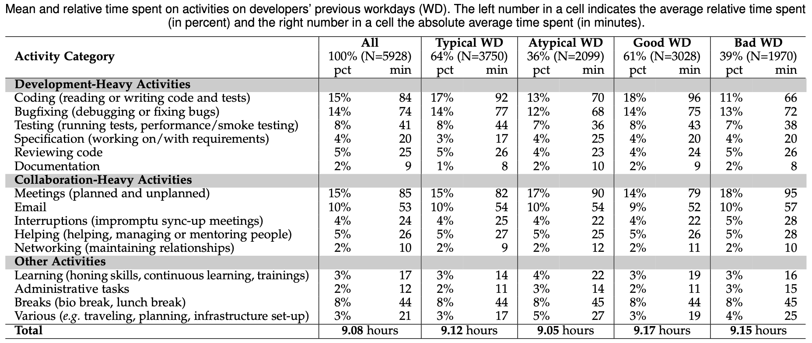
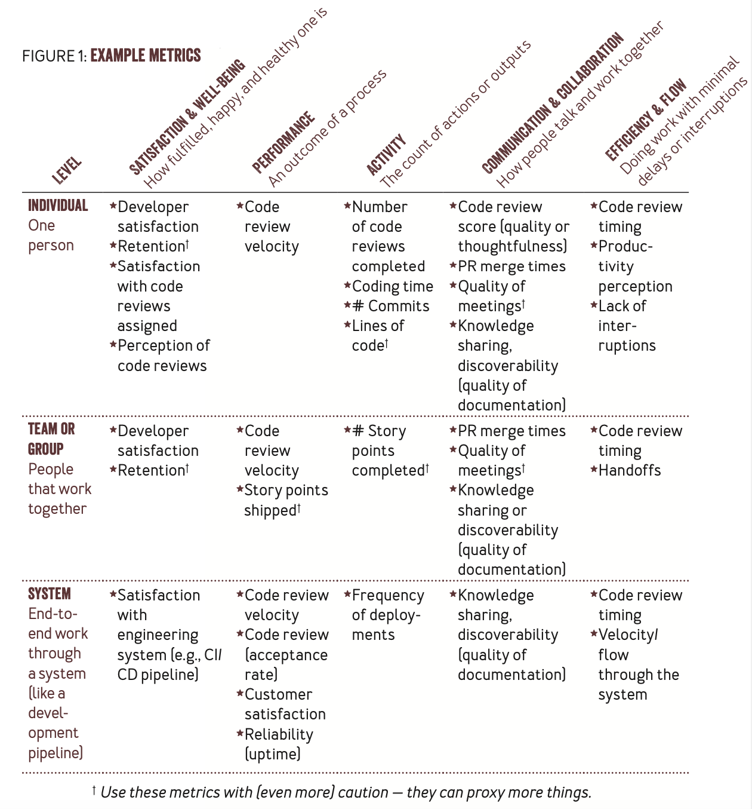

Today, developers spend about half their day on average in individual activities from reading and writing code and tests, debugging and reviewing code, documentation, and specification. knowledge to all contribute the day. Below table depics a “typical” developer work day [1]. 

Generative AI tools like GitHub Copilot (an AI Pair Programmer) have proven to increase developer productivity and helping business deliver software faster and value to the end customer. It’s up to the individual developer to optimize their current workflows, learn the tools, and derive the highest efficiency gains. I’ve had discussions with early stage startup founders that see GitHub Copilot as their “right hand” as they build out their ideas with a couple other engineers, all the way to the other end of the spectrum with senior developers who yet resist to use the tools at all. The message here is we must all adapt our workflow, just as we did with the introduction of Microsoft Excel, IDE’s, and Cloud SaaS solutions. The obvious question to come to mind is how do we quantify the increase in developer productivity, expectations of deliverables in a sprint, and how all of that translates to business OKRs.

## **Measure with SPACE, not DORA**

Productivity is **individudally perceived**. We are not told that we are productive but we feel it. I’d argue that there are a few checkboxes to tick in a given day for it to feel productive. Personally, attaining growth, exercise, and nourshing relationships must all be part of a day for me to consider it productive or complete. It’s a beautiful and fulfilling feeling. For a developer, we can imagine problem solving (not writing code), collaborating with team mates or cross-functionally, and gaining new knowledge can all play role in finding fulfillment. 

The ability to deliver meaningful work, whether it’s an architectural design or writing code ties closely to being able to enter a state of flow. Interruptions (email, slack, and SMS) disrupt the flow state and interfere with the ability to make progress. It’s critical that the work culture supports developers being able to timeblock a portion of the day to focus and not penalize them for delayed responses to async communication during that window. The goal is to limit *Context Switching* while you’re in a state of flow as that consumes mental energy and is cognitively costly[6]. It’s on developers as well to cultiavte the habits required to enter a state of flow and prolong it, from blocking the same recurring time window on daily basis, to taking breaks, and enabling *Focus Mode* to stop notifications from popping up during which. 

The right amount and type of collaboration largely impacts developers on day to day basis as well. Though too many meetings and specifically unnecessary meetings —ones you turn to async communication— can impede delivery, both short team huddles and async communication are positive and required to build and sustain trust between team members. One study found that going from two to three meetings per day lowered the chances of developer making progress towards their goals from 74% to a mere 14%[1]. Writing software is a team sport and we as humans seek connection and a shared mission to work towards. When measuring business outcomes, it’s best to focus on the team level rather than the individual to promote and rewards collaboration. It’s also valuable to appreciate those who contribute to enriching team culture, and perhaps rely on principal engineers to represent team culture and mentor the rest of the team[8]. 

Another focus factor is optimizing engineering systems to increase automation and reliability. This is where metrics like DORA come into play. E.g. Number of Pull Request, Lead Time, MTTR, and Change Failure Rate. As both people and systems contribute to delays in delivery, we can aim to optimize CI pipelines by scanning the impacted code files, running the required tests, and rightsizing hardware resources. We optimize human hand-off with good PR hygience and continously investing in a culture of collaboration. 

In terms of putting the above to practice, the best Framework I’ve come across is SPACE. SPACE breaks down developer productivity into five intertwined dimensions

- Satisfaction and well-being
- Performance
- Activity
- Communication & Collaboration
- Efficiency and Flow

Examples below of individual, team, and system metrics to measure for each dimentions.[2] 

One of the gaps I see in many engineering organization is the vague definition of success. Before focusing on measuring metrics, step back into discovery and clearly define what is critical and what is a nice-to-have. At what MTTR threshold do you see business imapct? What level of availability can you tolerate? And keep in mind that the tool are easy, the people are hard. Transformation, at its core, is a people problem.

SPACE emphasizes the need for both quantiative and qualitiative measures. Many solutions exist to plug into your engineerings systems to calculate and track quantiative indicators, leaving the qualitiative aspects for you to measure as you find fit for your own organizational and teams culture. Unlike quantiative metrics, I believe it’s less imperative to continously measure the qualitative side but to implement periodic —e.g. bi-annually— polls to gauge trends and find areas of focus. It’s one core component of running an engineering organization and gathering feedback. 

For a detailed review of the framework and a dive into the five myths it debuks, review the below video by Dr. Nicole Forsgren, the researcher behind the framework. 

<iframe width="560" height="315" src="https://www.youtube.com/embed/t7SXM7njKXw" frameborder="0" allow="autoplay; encrypted-media" allowfullscreen></iframe>

Accenture, a consulting powerhouse with over a hundred thousand developers worldwide, presented an example of how they used four SPACE dimensions to quanify the impact of enabling developers with GitHub Copilot [9]

<iframe width="560" height="315" src="https://www.youtube.com/embed/AAT4zCfzsHI?feature=shared&t=1518" frameborder="0" allow="autoplay; encrypted-media" allowfullscreen></iframe>

You can adap SPACE to measuring productivity in other orgs. I can see how it translates to a revenue team, marketing team, or product team. At the base of it, it’s a multi-dimensional framework to measure productivitiy. 

## **Summary**

The key messages I’m emphasizing in this blog post are:

- Measuring qualitative individual and team metrics is as important as measureing system metrics. Use the SPACE Framework as guidance to building your surveys and defining metrics.
- People over systems; Teams over individuals.
- Architecture and training teams must guide developers to adapt their workflows and efficiently use Generative AI in their day to day.

**References**

- [1] Today was a Good Day: The Daily Life of Software Developers https://discovery.ucl.ac.uk/id/eprint/10090507/1/Barr_Today%20was%20a%20Good%20Day.%20The%20Daily%20Life%20of%20Software%20Developers_AAM2.pdf
- [2] The SPACE of Developer Productivity: There’s more to it than you think — Nicole Forsgren, Margaret-Anne Store, Microsoft Research [Mar’21] https://dl.acm.org/doi/10.1145/3454122.3454124
- [3] The SPACE of Developer Productivity [May’21] https://www.youtube.com/watch?v=t7SXM7njKXw
- [4] Octoverse Spotlight 2021: The Good Day Project — Personal analytics to make your work days better. https://github.blog/2021-05-25-octoverse-spotlight-good-day-project/
- [5] Engineering Enablement podcast — Measuring and rolling out AI coding assistants, Eirini Kalliamvakou [Jan’24] https://getdx.com/podcast/eirini-kalliamvakou-github/
- [6] DevEx: What Actually Drives Productivity: The developer-centric approach to measuring and improving productivity. [May’23] https://dl.acm.org/doi/10.1145/3595878
- [7] Research: quantifying GitHub Copilot’s impact on developer productivity and happiness. [Sep’22] Blog https://github.blog/2022-09-07-research-quantifying-github-copilots-impact-on-developer-productivity-and-happiness/
- [8] Survey Reveals AI’s Impact on the Developer Experience. [Jun’23]. https://github.blog/2023-06-13-survey-reveals-ais-impact-on-the-developer-experience/
- [9] GitHub Copilot: The AI Pair Programmer of Today and Tomorrow https://youtu.be/AAT4zCfzsHI?feature=shared&t=1518